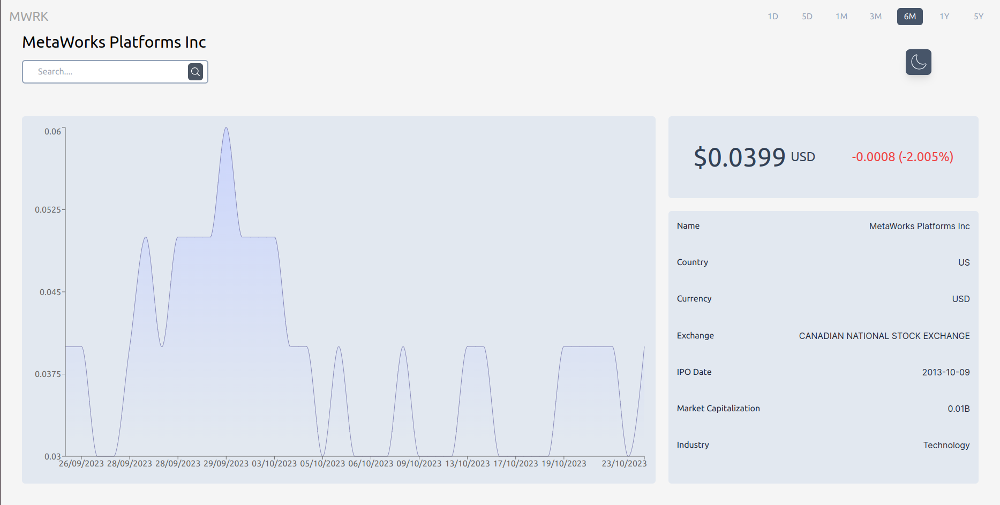
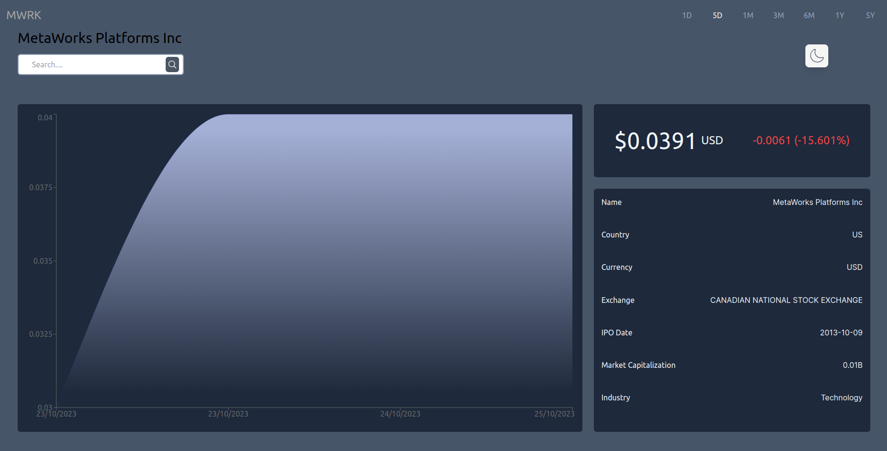

# Stock Display Dashboard




Hello Everyone this is my realtime stocks display website for various companies who has gone IPO.

## Key Features

- **Wide Vairety of Timestamp**: A wide variety of timestamp from days to various months to five years of timestamp is available to give user a detailed overview of the companies journey so far.

- **Dark & Light Mode**: The website integrates a dark and light theme which can be toggled using the moon button. 

- **Responsive Design**: This site adapts seamlessly to various screen sizes and devices, ensuring a consistent user experience.

## Technologies Utilized

- [React](https://reactjs.org/): Used this JavaScript library to build the user interface and
functionality.

- [Tailwind](https://tailwindcss.com/) : Used this Tailwind Framework to design the website.

- [FinnhubAPI](https://finnhub.io/docs/api) : Used this API key to fetch the realtime Stocks Data.


## Installation

1. Clone this repository to your local machine:

   ```bash
   git clone https://github.com/rijuoddusual1999/Stock_Display_Dashboard
   ```

2. Navigate to project directory:

    ```bash
    cd In the project folder
    ```

3. Install the required dependencies:

    
    ```bash
    npm install
    ```


4. Add a .env file in the project folder and put the Finnhub API key with the below extension:

    
    ```bash
    VITE_API_URL = 'ADD_YOUR_API_KEY_HERE'
    ```    

5. Start the local hosting:

   
    ```bash
    npm run dev 
    ```
    